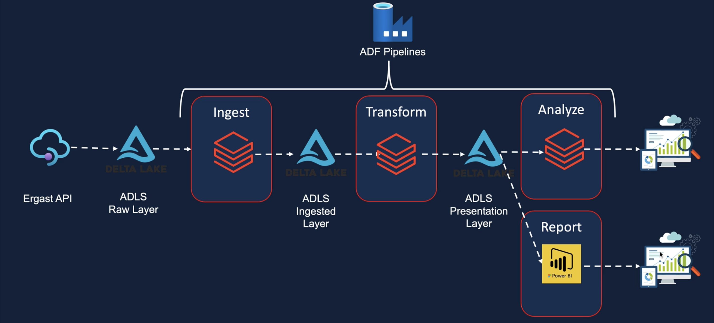

# Formula 1 Racing Analysis using Azure Databricks

## Pipeline Diagram

# Project Overview
This project is a comprehensive data engineering solution for analyzing Formula 1 racing data using Azure Databricks, Delta Lake, Unity Catalog, and Azure Data Factory. The primary objective is to build an end-to-end pipeline that ingests, processes, and visualizes data efficiently.

## Solution Architecture
The architecture of this solution integrates multiple Azure services to create a robust and scalable data pipeline:

***Azure Databricks:*** For data processing and transformation using PySpark and SQL.
***Azure Data Lake Gen2:*** For storage of raw and processed data.
***Azure Data Factory:*** For orchestrating and automating data workflows.
***Power BI:*** For creating interactive dashboards to visualize the outputs.

##Key Components
### **Azure Databricks**

- **Creating and Configuring Databricks Service:**
  - Setting up the Azure Databricks workspace.
  - Configuring clusters, cluster pools, and jobs for efficient resource management.

- **Databricks Notebooks:**
  - Using Databricks notebooks for interactive data analysis and development.
  - Utilizing Databricks utilities and magic commands for streamlined workflows.
  - Passing parameters between notebooks and creating notebook workflows for modular code execution.
  - Data Integration and Transformation:

Mounting Azure Storage in Databricks using secrets from Azure Key Vault.
Working with Databricks Tables and Databricks File System (DBFS).
Delta Lake Implementation:

Implementing the Lakehouse architecture with Delta Lake.
Utilizing Delta Lake for data reliability and performance enhancements.
Creating dashboards in Databricks to visualize outputs.
Connecting Databricks tables to Power BI for advanced analytics.
Spark (PySpark and SQL)
Spark Architecture:

Understanding the Spark architecture and its components, such as Data Sources API and DataFrame API.
Data Ingestion and Transformation:

Ingesting CSV and JSON files into the data lake as Parquet files/tables using PySpark.
Performing data transformations like Filter, Join, Aggregations, GroupBy, and Window functions using both PySpark and SQL.
Creating and managing local and temporary views for querying data.
Data Loading Patterns:

Implementing full refresh and incremental load patterns using partitions.
Delta Lake
Data Lakehouse Architecture:

Understanding the emergence of the Data Lakehouse architecture and the role of Delta Lake.
Delta Lake Operations:

Reading, writing, updating, deleting, and merging data into Delta Lake using PySpark and SQL.
Utilizing Delta Lake features like History, Time Travel, and Vacuum for data management.
Converting Parquet files to Delta files and implementing incremental load patterns.
Unity Catalog
Data Governance with Unity Catalog:
Setting up Unity Catalog Metastore and enabling Databricks workspace with Unity Catalog.
Creating and managing Unity Catalog objects with a three-level namespace.
Configuring and accessing external data lakes via Unity Catalog.
Implementing data governance capabilities like Data Discovery, Data Audit, Data Lineage, and Data Access Control.
Azure Data Factory
Pipeline Creation and Management:
Creating pipelines to execute Databricks notebooks.
Designing robust pipelines to handle unexpected scenarios like missing files.
Setting up dependencies between activities and pipelines.
Scheduling pipelines using data factory triggers for regular execution.
Monitoring pipelines and triggers to check for errors and outputs.
Visualizations
Creating Interactive Dashboards:
Using Power BI to connect to Azure Databricks tables.
Building interactive dashboards to visualize Formula 1 racing data insights.
Conclusion
This project demonstrates the power and flexibility of Azure Databricks, Delta Lake, Unity Catalog, and Azure Data Factory in building a scalable and efficient data engineering solution. By leveraging these technologies, we can process and analyze large datasets effectively and gain valuable insights into Formula 1 racing.

Getting Started
To get started with this project, follow these steps:

Clone the Repository:

sh
Copy code
git clone https://github.com/yourusername/f1-racing-analysis.git
cd f1-racing-analysis
Set Up Azure Databricks Workspace:

Create an Azure Databricks workspace.
Configure clusters and cluster pools.
Mount Azure Storage:

Use secrets from Azure Key Vault to mount Azure Storage in Databricks.
Run Databricks Notebooks:

Execute the Databricks notebooks to ingest, transform, and analyze the data.
Create and Monitor Pipelines:

Set up pipelines in Azure Data Factory to automate the workflows.
Visualize Data:

Connect Power BI to Databricks tables and create dashboards.

